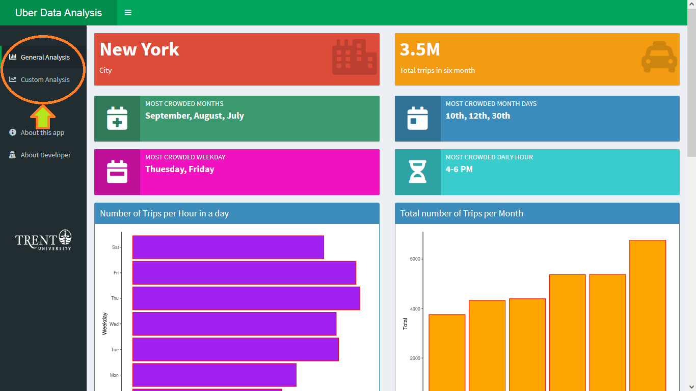
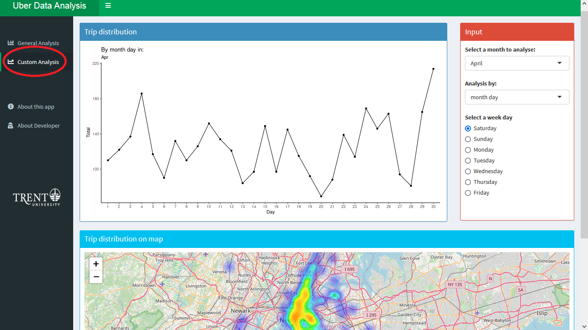

<p align="right">
{width=20%}
</p>

```{r Ahthor, include=FALSE}
knitr::opts_chunk$set(echo = TRUE)
```


###### Course: Data Analysis with R (AMOD5250)
###### Instructor: Dr. Albert Geoff Crane
###### Trent University
###### [View this report on the web](https://rpubs.com/hadifarzin/uber)
```{r setup, include=FALSE}
knitr::opts_chunk$set(echo = TRUE)
```


# **Title: Ride-sharing application data analysis**


# Introduction

Nowadays we are witnessing the growth of rid-sharing popularity and the amount of data that are creating in these applications even every minute and we are facing a huge volume of data (big data) generating in this business ecosystem. Over the past decade, ride-hailing services such as Uber, Lyft, Gett, Juno, and Via have revolutionized the transportation space. However, profitability for drivers varies across all these platforms in complicated ways. Drivers are forced to make mental calculations based on the time of day, surge rate, wait time to pick up a rider, etc. for each driving service, and choose to ride for a given service at any point based on the optimization of such factors. 
 
The purpose of this service is to share a ride with others and earn extra money.  There are different varieties of ride-sharing services around the globe with different business models and a variety of services. In this ecosystem, there are three main players: Rider, Passenger, and the platform owner. upon each ride, we see that some data is generated. For example, some information that is generated in one ride is the date and time of ride request, the origin and destination location, the distance, the fee, and the duration time of the trip. Also, we can add some extra information to these data such as the weather condition and temperature, the traffic volume, the ratings, number of passengers, and so on. 
 
# Objectives

One challenge for riders in these applications is that how they can manage their time off work and where they should work to minimize their costs and maximize their earnings. Data analysis can resolve this problem. So the main objective of this project is to provide some analysis that helps the rider to find the best time and the best location to work. 

For this purpose, ride-share application providers offer their riders the possibility of requesting a copy of your data, which includes the complete history of your trips. We will take advantage of this to analyze and visualize some interesting personal data. But you as a rider should be able to analyze these data. Obviously, most of the riders are not data analysis specialists so they cannot utilize the give data. So I am going to create an app for riders and make them able to see the results of some useful analysis on their data. Based on that they will get an insight into their performance and details of what they do over the last year and will be able to manage their future trips wisely.  But for this markdown, I am going to just visualize some facts regarding ride-sharing data in a specific area at a specific time.
 
# Dataset

There are some ride-sharing applications in the market but a few of them have published public datasets. The data collection for this app idea was by no means straightforward. To avoid having their information used for competitive purposes, most ride-share companies will do everything in their power to protect their data. However, with some deliberation, we can actually discover a couple of backdoor methods to access these data. All ride-share apps in NYC are under the Taxi and Limousine Commission (TLC) and are required by law to submit data on every ride that occurs. With some investigation, the keen observer will find that TLC is part of the NYC Open Data initiative, which was established to increase transparency in state and city affairs. While the data these rideshare companies do provide are incredibly shallow (minimal information per ride), we can still pull quite a bit of information from them. To start us off, however, I‘m using Uber data from April 2014 that has a slightly different format to the TLC dataset. This dataset includes more than 4.5 million trips within the 6 months (April to September 2014) and is composed of the date and time of the trip and the location of the request origin. Below you can see the head and tail of the table.

First we should load some required packages:
```{r import libraries, echo=TRUE, message=FALSE, warning=FALSE}

library(knitr)
library(ggplot2)
library(ggthemes)
library(lubridate)
library(dplyr)
library(tidyr)
library(scales)
library(rstatix)
library(kableExtra)
```

Loading the dataset for analysis. The original database is including 6 .csv files for months: Apr, May, Jun, Jul, Aug ,and Sep. I combined them into one file named uber_raw_data.csv. But this data is really really big (more than 4 million records so I have to make a sample to be able to run the analysis codes. So what you can see here is a sampled dataset with randomly selected 30,000 records).

```{r Load dataset, echo=TRUE, message=FALSE, warning=FALSE, cache=TRUE}
uber_data_sampled <- read.csv("uber_small_dataset.csv")
uber <- uber_data_sampled  # keep a copy of the dataset to using further
```

Showing the first 10 rows of the table. To show the table in a nice and tidy format I used the Kable package. 
```{r Table showing, echo=TRUE, message=FALSE, warning=FALSE, results='asis'}
uber[1:10,] %>%
  kbl() %>%
  kable_styling(bootstrap_options='striped' , position= 'left', full_width = FALSE)
```


## Data preparation
As it can be seen from the above table, the column time is pointing to the date and time of the trip. First, we should convert this value from text to Date and Time type and also separate the fields: Day, Month, Year, Hour, Minute ,and Second.

There is some unused column that should be removed.
```{r removing unused column, echo=TRUE, message=FALSE, warning=FALSE}
uber <- select(uber, -c(1,2,6))  # Drop unused columns(Index and Base)
```

Final table is ready to analyze:
```{r Table showing after removing columns, echo=FALSE, message=FALSE, warning=FALSE, results='asis'}
uber[1:5,] %>%
  kbl() %>%
  kable_styling(bootstrap_options='striped' , position= 'left', full_width = FALSE)
```


### 1. Convert text date to Date type
First, we should convert the Date. Time column to the Date type variable. For doing this, I used POSIXct function.
```{r Convert to Date Type, echo=TRUE, message=FALSE, warning=FALSE}
uber$Date.Time <- as.POSIXct(uber$Date.Time, format = "%m/%d/%Y %H:%M:%S")
```

The output table after converting/creating the date column.
```{r Table showing2, echo=FALSE, message=FALSE, warning=FALSE, results='asis'}
uber[1:5,] %>%
  kbl() %>%
  kable_styling(bootstrap_options='striped' , position= 'left', full_width = FALSE)
```


### 2. Create Day/Month/Year/Day of Week columns
Now I try to split the Date column into four columns day,month,year and weekday. Because I want to do some analysis based on those.

```{r Split the Date, echo=TRUE, message=FALSE, warning=FALSE}
uber$day       <- factor(day(uber$Date.Time))  # Create day column
uber$month     <- factor(month(uber$Date.Time, label = TRUE)) # Create month column
uber$year      <- factor(year(uber$Date.Time))  # Create year column
uber$dayOfWeek <- factor(wday(uber$Date.Time, label = TRUE))  # Create week day column
```

```{r Table showing3,results='asis', echo=FALSE, message=FALSE, warning=FALSE}
uber[1:5,] %>%
  kbl() %>%
  kable_styling(bootstrap_options='striped' , position= 'left', full_width = FALSE)
```

### 3. Create Time columns
At this stage, I create a new column called Times to have the Time separatly. Also other three new columns for storing Hour, Minute ,and Second of the trip.

```{r Split the Time, echo=TRUE, message=FALSE, warning=FALSE}
uber$Time   <- format(uber$Date.Time, format="%H:%M:%S") # Create the Time column 

uber$hour   <- factor(hour(hms(uber$Time)))  # Create hour column
uber$minute <- factor(minute(hms(uber$Time)))# Create Minute column
uber$second <- factor(second(hms(uber$Time)))# Create Second column
```

```{r Table showing4, echo=FALSE, message=FALSE, warning=FALSE}
uber[1:5,] %>%
  kbl() %>%
  kable_styling(bootstrap_options='striped' , position= 'left', full_width = FALSE)
```

Now the data is ready to analyze. Let's GO and have a fun...diving to the data ;)

# Method
Here in this section, I will explain how I analyzed the ride-sharing dataset. As I mentioned above the dataset I want to analyze is belonged to the Uber application which was released by this company in 2015. The analysis has been done in two main methods. The first method is time analysis and the second is location analysis. Based on these two types of analysis I am going to achieve some results that show what is the best time and location for uber drivers to work in New York city.

### 1. Time analysis

In this section, I am going to do some analysis based on the time of trips. So we can find out the most popular time for requesting an Uber ride among the Uber customers based on the time in a day, in a week, and in a month.

### 1.1. Trips per hour in a day

First, let's see what is the distribution of total trips in different hours in a day over the 6 months. For this purpose, we should group by the Hour column.

```{r Group by the Hour, echo=TRUE, message=FALSE, warning=FALSE}
uber_group_hour <- uber %>%
  group_by(hour) %>%
  dplyr::summarize(Total = n()) 
```

Now I can plot the bar chart distribution of trips in a day.
```{r plot count trips in a day hours, echo=TRUE, message=FALSE, warning=FALSE}

# plot number of trips in different hours in a day
ggplot(uber_group_hour, aes(hour, Total)) + 
        geom_bar( stat = "identity", fill = "steelblue", color = "red") +
           ggtitle("Number of Trips per Hour in a day") +
            theme(legend.position = "none") +
            scale_y_continuous(labels = comma)
```


### 1.2. Number of Trips in each month


First, let's see what is the distribution of total trips in different 6 months. For this purpose, we should group by the month column.

```{r Group by the month, echo=TRUE, message=FALSE, warning=FALSE}
uber_group_month <- uber %>%
  group_by(month) %>%
  dplyr::summarize(Total = n()) 
```


Now I can plot the bar chart distribution of trips in a day.
```{r plot count trips in each month, echo=TRUE, message=FALSE, warning=FALSE}

# plot number of trips in different hours in a day
ggplot(uber_group_month, aes(month, Total)) + 
        geom_bar( stat = "identity", fill = "steelblue", color = "red") +
           ggtitle("Total number of Trips each month") +
            theme(legend.position = "none") +
            scale_y_continuous(labels = comma)
```

The result shows that the trips mostly occur in September and that could because of starting the educational season (school and university).


### 1.3. Trips in each month per hour in a day

Now let's group by month and see how the number of trips distributed in each month per hour in a day. For this purpose, I grouped the dataset by two attributes hour and month.


```{r Group by the Hour and Month, echo=TRUE, message=FALSE, warning=FALSE}
uber_group_hour_month <- uber %>%
  group_by(hour,month) %>%
  dplyr::summarize(Total = n()) 
```

Plotting the bar chart to illustrate the above table.
```{r plot count trips in a day hours months, echo=TRUE, message=FALSE, warning=FALSE}
ggplot(uber_group_hour_month, aes(hour, Total, fill = month)) + 
       geom_bar( stat = "identity") +
          ggtitle("Number of Trips per Hour in a day") +
           scale_y_continuous(labels = comma)
```
The result shows that the trips mostly occur in the morning between 6 to 9 and in the evening between 15 to 22. The peak of the numbers is between 16 to 18. That's because at this time most of the employees want to go back home and it the finish time of business hours and also the time for folks to go shopping or restaurant.  The bar chart shows that the distribution of trips follows the same trend within the different months.


### 1.4. Trips per weekday

Analyzing the number of trips in each day of the week gives us a better insight of the trip distribution over time. Here I grouped the data by the 'day' column and 'month' column.


```{r Group by the day and month , message=FALSE, warning=FALSE}
uber_group_day_month <- uber %>%
         group_by(month, day) %>%
             dplyr::summarize(Total = n())
```

You see the data table with the total number of trips per day in each month:

Ploting the bar chart to illustrate the above table.
```{r plot count trips in a day and months, echo=TRUE, message=FALSE, warning=FALSE}
colors = c("#CC1011", "#665555", "#05a399", "#cfcaca", "#f5e840", "#0683c9", "#e075b0") # deffine collors map for ggplot
ggplot(uber_group_day_month, aes(day, Total, fill = month)) + 
        geom_bar( stat = "identity") +
           ggtitle("Number of Trips by Day in each Month") +
            scale_y_continuous(labels = comma) +
            scale_fill_manual(values = colors)
```

### 1.5. Trips per Hour in daymonth 

```{r Group by the hour and week day, message=FALSE, warning=FALSE}
uber_group_hour_DOW <- uber %>%
  group_by(hour,dayOfWeek) %>%
  dplyr::summarize(Total = n())
```


You see the data table with the total number of trips per hour in each weekday:
```{r show Grouped table hour and week day, echo=TRUE, message=FALSE, warning=FALSE}
uber_group_hour_DOW[1:8,] %>%
  kbl() %>%
  kable_styling(bootstrap_options='striped' , position= 'left', full_width = FALSE)
```

Plotting the Heatmap chart to demonstrate the total number of trips in each hour per weekday.
```{r plot count trips in a hour and week day, message=FALSE, warning=FALSE}
# heatmap chart Hour/WeekDay
ggplot(uber_group_hour_DOW, aes(hour,dayOfWeek, fill = Total)) + 
  geom_tile()+
  ggtitle("Number of Trips by Hour in each Day in week")
```

### 1.6. Trips in Day of the week in each month 

```{r Group by the week day and month, message=FALSE, warning=FALSE}
uber_group_DOW_month <- uber %>%
  group_by(dayOfWeek,month) %>%
  dplyr::summarize(Total = n())
```


You see that the data table with the total number of trips per hour in each weekday:
```{r show Grouped table week day and month, echo=TRUE, message=FALSE, warning=FALSE}
uber_group_DOW_month[1:8,] %>%
  kbl() %>%
  kable_styling(bootstrap_options='striped' , position= 'left', full_width = FALSE)
```

the Heatmap chart below illustrates the total number of trips in each hour per weekday.
```{r plot count trips in week day per month, echo=TRUE, message=FALSE, warning=FALSE}
# heatmap chart Month/WeekDay
ggplot(uber_group_DOW_month, aes(month,dayOfWeek, fill = Total)) + 
  geom_tile()+
  ggtitle("Number of Trips by Day week and month")
```


### 2. Location-based analysis
In this section, I will provide some analysis that shows the distribution of the trips in terms of location. The current dataset belongs to New Your city and shows the occurred trips in this city. 

First, we should load the required package to show points on a map.
```{r echo=TRUE, message=FALSE, warning=FALSE}
library(leaflet) # map features
library(leaflet.extras)

polygon_NYC <- read.csv("downtown_NYC.csv") # Loading polygon of downtown area for showing on the map

# creating a map and showing the trips location on it
leaflet() %>%
  addTiles() %>%
  setView(lat= 40.716368, lng =  -73.991305 , zoom=11) %>%
  addCircleMarkers(lng = uber$Lon,lat=uber$Lat, radius = 0.1, color="red") %>%
  addPolygons(lng = polygon_NYC$lon,lat = polygon_NYC$lat, color = "blue")
```
According to the map, most trips were requested within the downtown area. We can also plot the location distribution based on the hour in a day and days in a week and months in a year. But due to the high computational costs, I didn't bring it to this report.


We can show the location of requested trips on the map in different months.

Total trips in April on the map
```{r echo=TRUE, message=FALSE, warning=FALSE}
uber_sampl1 <- filter(uber, month =="Apr" )

leaflet() %>%
  addTiles() %>%
  setView(lat=40.669493, lng = -73.897354 , zoom=10) %>%
  addHeatmap(lng = uber_sampl1$Lon,lat=uber_sampl1$Lat,max = 1, radius = 8) %>%
  addPolygons(lng = polygon_NYC$lon,lat = polygon_NYC$lat, color = "black")

```

Total trips in May on the map
```{r echo=TRUE, message=FALSE, warning=FALSE}
uber_sampl2 <- filter(uber, month =="May" )

leaflet() %>%
  addTiles() %>%
  setView(lat=40.669493, lng = -73.897354 , zoom=10) %>%
  addHeatmap(lng = uber_sampl2$Lon,lat=uber_sampl2$Lat,max = 1, radius = 8) %>%
  addPolygons(lng = polygon_NYC$lon,lat = polygon_NYC$lat, color = "black")

```

Total trips in June on map
```{r echo=TRUE, message=FALSE, warning=FALSE}
uber_sampl3 <- filter(uber, month =="Jun" )

leaflet() %>%
  addTiles() %>%
  setView(lat=40.669493, lng = -73.897354 , zoom=10) %>%
  addHeatmap(lng = uber_sampl3$Lon,lat=uber_sampl3$Lat,max = 1, radius = 8) %>%
  addPolygons(lng = polygon_NYC$lon,lat = polygon_NYC$lat, color = "black")

```

Total trips in July on the map
```{r echo=TRUE, message=FALSE, warning=FALSE}
uber_sampl4 <- filter(uber, month =="Jul" )

leaflet() %>%
  addTiles() %>%
  setView(lat=40.669493, lng = -73.897354 , zoom=10) %>%
  addHeatmap(lng = uber_sampl4$Lon,lat=uber_sampl4$Lat,max = 1, radius = 8) %>%
  addPolygons(lng = polygon_NYC$lon,lat = polygon_NYC$lat, color = "black")

```

Total trips in August on the map
```{r , message=FALSE, warning=FALSE}
uber_sampl5 <- filter(uber, month =="Aug" )

leaflet() %>%
  addTiles() %>%
  setView(lat=40.669493, lng = -73.897354 , zoom=10) %>%
  addHeatmap(lng = uber_sampl5$Lon,lat=uber_sampl5$Lat,max = 1, radius = 8) %>%
  addPolygons(lng = polygon_NYC$lon,lat = polygon_NYC$lat, color = "black")

```

Total trips in September on map
```{r ,  message=FALSE, warning=FALSE}
uber_sampl6 <- filter(uber, month =="Sep" )

leaflet() %>%
  addTiles() %>%
  setView(lat=40.669493, lng = -73.897354 , zoom=10) %>%
  addHeatmap(lng = uber_sampl6$Lon,lat=uber_sampl6$Lat,max = 1, radius = 8) %>%
  addPolygons(lng = polygon_NYC$lon,lat = polygon_NYC$lat, color = "black")

```

 
## Conclusion
Based on the done analysis now we are ready to provide some valuable information that can help drivers to choose the best time and location that has the most demand for riding. Here I will summarize the results by answering some critical questions that drivers may be interested to know the answers to. 

### Which three **months** have the most demand for the ride?
```{r,echo=FALSE, message=FALSE, warning=FALSE}
month_max <- uber_group_month # copy data
month_max <- month_max[order(month_max$Total, decreasing = TRUE),] # ordering data by number of trips in each hour
month_max_3 <- head(month_max,3)[1:3,1] # show the first 3 top day with maximum trip 
kable(month_max_3)


```


### Which **month day** has the maximum pick of riding request?
```{r,echo=FALSE, message=FALSE, warning=FALSE}
uber_group_day <- uber %>%
  group_by(day) %>%
  dplyr::summarize(Total = n()) 

day_max <- uber_group_day # copy data
day_max <- day_max[order(day_max$Total, decreasing = TRUE),] # ordering data by number of trips in each hour
kable(head(day_max,3)[1:1,1]) # show the first 3 top day with maximum trip 

```


### What **time** is the most popular for ride-sharing **in a day**?
```{r,echo=FALSE, message=FALSE, warning=FALSE}
hour_max <- uber_group_hour # copy data
hour_max <- hour_max[order(hour_max$Total, decreasing = TRUE),] # ordering data by number of trips in each hour
hour_max_3 <- head(hour_max,3)[1:3,1] # show the first 3 top day with maximum trip 
kable(hour_max_3)
```


### Which top three **days in a week** have the most demand for the ride?
```{r,echo=FALSE, message=FALSE, warning=FALSE}
uber_group_DOW <- uber %>%
  group_by(dayOfWeek) %>%
  dplyr::summarize(Total = n()) 

DOW_max <- uber_group_DOW # copy data
DOW_max <- DOW_max[order(DOW_max$Total, decreasing = TRUE),] # ordering data by number of trips in each hour
month_DOW_3 <- head(DOW_max,3)[1:3,1] # show the first 3 top day with maximum trip 
kable(month_DOW_3)
```


### Which three **Locations** have the most demand for ride?
```{r,echo=FALSE, message=FALSE, warning=FALSE}
uber_rounded <- uber # a copy of data
uber_rounded$Lat <- round(uber$Lat,2) # round the Lat 
uber_rounded$Lon <- round(uber$Lon,2) # round the Lon 

# group by Lat and Lon
uber_group_lat <- uber_rounded %>%
  group_by(Lat,Lon) %>%
  dplyr::summarize(Total = n())

loc_max <- uber_group_lat # copy of data
loc_max <- loc_max[order(loc_max$Total, decreasing = TRUE),] # ordering data by number of trips in each location
loc_max_3 <- head(loc_max,3)[1:3,] # show the first 3 top locations with maximum trip 

# Showing on the map
leaflet() %>%
  addTiles() %>%
  setView(lat= loc_max_3$Lat[1], lng =  loc_max_3$Lon[1] , zoom=11) %>%
  addCircleMarkers(lng = loc_max_3$Lon,lat=loc_max_3$Lat, radius = 10,color="blue")
```

### App user manual
In this project, I created a shiny app to work with data. You can view the app [here](https://6fzge0-h-farzin.shinyapps.io/Uber_Data_Analysis/). In this app, you can find two sections: 

<br>
*1.* General Analysis 
*2.* Custom Analysis
</br>

<p align="center">
{width=60%}
</p>

<br>
</br>
In General Analysis you can find general analysis of uber dataset. Some fact and figures and charts demonstrate information regarding the uber trips within the 6 month in 2014. 

<br></br>

In Custom Analysis section, the user can choose the analysis parameters to see the results. 
<p align="center">
{width=60%}
</p>

In this section user can select the month he/she wants to analyse. User can select the type of analysis:
*1.* Analysis based on Month day
*2.* Analysis based on Weekday
*3.* Analysis based on Day hour 

Another input that user can choose is the weekday. This option is applied when the type of analysis set on "Analysis based on Day Hour".

### References 
[1] https://github.com/fivethirtyeight/uber-tlc-foil-response/tree/master/uber-trip-data
\
[2] https://towardsdatascience.com/analyzing-rideshare-data-a7c83f95cd65
\
[3] https://www.kaggle.com/theoddwaffle/uber-data-analysis